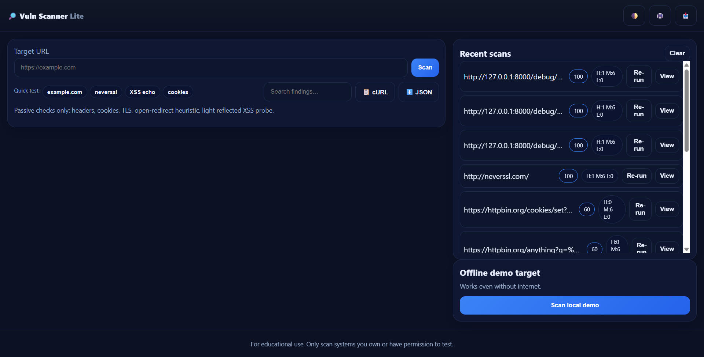
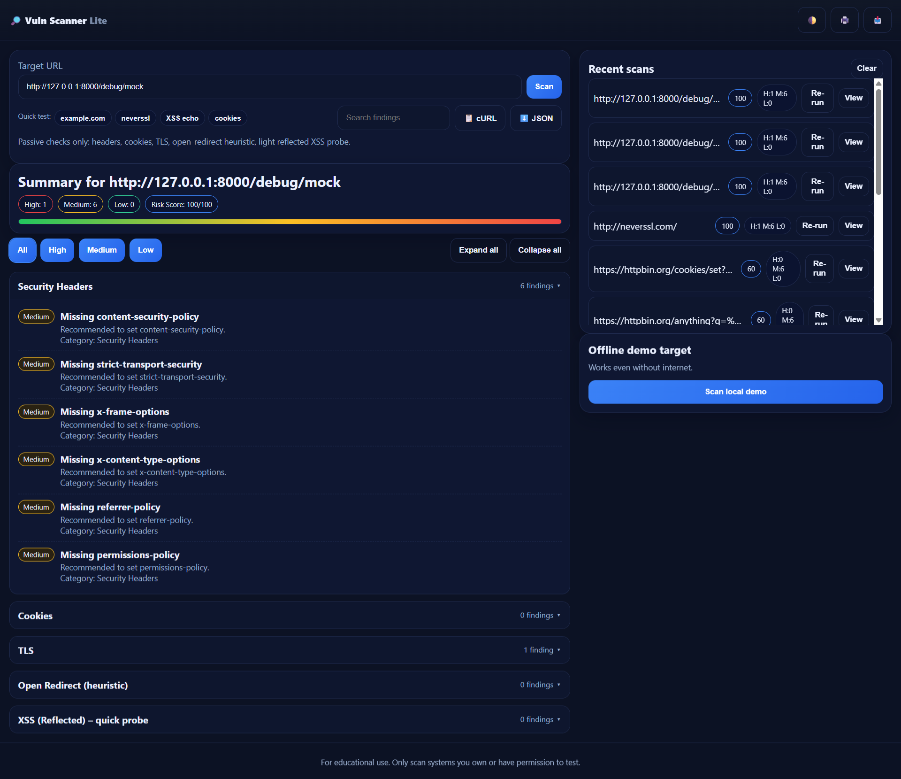
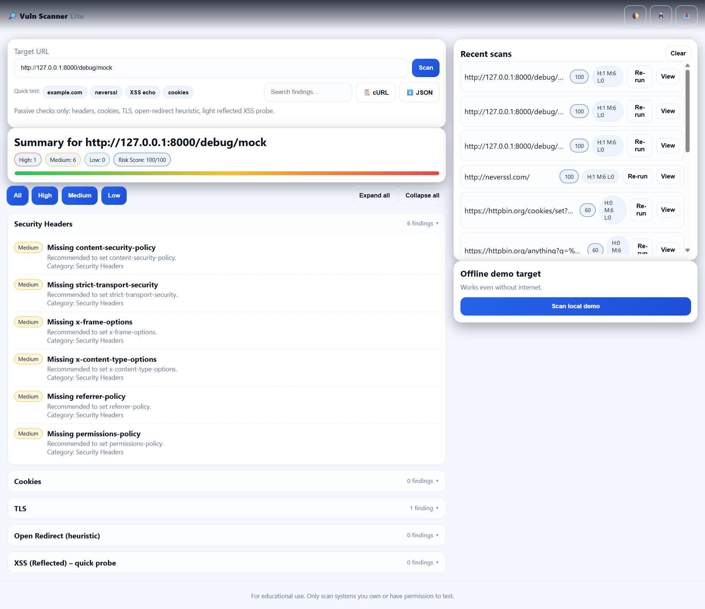

# 🔎 Web Vulnerability Scanner (Lite)

A clean, **web-based passive scanner** (Flask + vanilla JS) that checks common web security issues without intrusive testing.

- Security **headers** (missing/weak)
- Cookie flags (**Secure / HttpOnly / SameSite**)
- Basic **TLS** usage (HTTP vs HTTPS, surfacing TLS errors)
- **Open-redirect** parameter heuristics
- Light **reflected XSS** echo probe (safe GET reflection)

> **Local-first:** runs on your machine only. No destructive actions. For educational use.

---

## 📸 Screenshots

> Place images in `assets/` using **these exact names**.

| Home | Dark Theme | Light Theme |
|:---:|:---:|:---:|
|  |  |  |

---

## 🧭 Table of contents

- [Features](#-features)
- [Architecture](#-architecture)
- [Project structure](#-project-structure)
- [Run locally](#-run-locally)
- [Safe test URLs](#-safe-test-urls)
- [API endpoints](#-api-endpoints)
- [Configuration](#-configuration)
- [How to add screenshots](#-how-to-add-screenshots)
- [Troubleshooting](#-troubleshooting)
- [Roadmap](#-roadmap)
- [Ethics & disclaimer](#-ethics--disclaimer)
- [License](#-license)

---

## ✅ Features

- **Professional blue UI**, responsive, with **light/dark theme**
- Navbar with dropdown: **Theme**, **Print**, **Import/Export JSON**, **Copy cURL**
- **Search** findings + **severity filters** (All / High / Medium / Low)
- Collapsible **result groups** (+ Expand/Collapse all)
- **JSON export/import**, **Print to PDF**, **Copy cURL**
- **Recent scans** (browser localStorage) with **Re-run** and **View (offline)**
- Built-in **demo page** (`/debug/mock`) for offline showcasing
- Clean **no-preflight** frontend request pattern (uses `text/plain`)

---

## 🏗 Architecture

```text
[ Browser UI (frontend/) ]
   ├─ index.html • styles.css • app.js
   │   ├─ POST /scan  (text/plain → avoids CORS preflight)
   │   ├─ Renders summary, filters, groups, export/import
   │   └─ Stores "Recent scans" in localStorage
   ▼
[ Flask API (backend/app.py) ]
   ├─ /scan          → runs checks and returns JSON report
   ├─ /health        → simple readiness probe
   ├─ /debug/mock    → local HTML (weak headers/cookie) for demo
   └─ /debug/egress  → outbound HTTP reachability (optional)
      ▼
   scanners/
     ├─ headers.py   → security headers
     ├─ cookies.py   → cookie flags
     ├─ tls.py       → TLS basics
     ├─ redirect.py  → open-redirect heuristic
     ├─ xss.py       → safe reflected-XSS probe
     └─ utils.py     → fetch (timeouts, proxies, TLS options)


🗂 Project structure
vuln-scanner/
├─ backend/
│  ├─ scanners/
│  │  ├─ headers.py  cookies.py  xss.py  redirect.py  tls.py  utils.py
│  └─ app.py
├─ frontend/
│  ├─ index.html  styles.css  app.js
├─ assets/
│  ├─ homepage.png  darktheme.png  lighttheme.png   # ← your screenshots
├─ requirements.txt
├─ README.md
└─ .gitignore


🚀 Run locally
1) Backend (Flask)
cd backend
python -m venv venv

# Windows:
venv\Scripts\activate
# macOS/Linux:
# source venv/bin/activate

pip install -r ../requirements.txt
python app.py
# ➜ Running on http://127.0.0.1:8000

2) Frontend (static server)
cd ../frontend
python -m http.server 5500 --bind 127.0.0.1
# ➜ Open http://127.0.0.1:5500/index.html

Make sure frontend/app.js targets your local backend:
const API = "http://127.0.0.1:8000";


🧪 Safe test URLs

Local demo (works offline):
http://127.0.0.1:8000/debug/mock

Missing headers:
https://example.com

No HTTPS (expect High):
http://neverssl.com/

Echo/XSS probe:
https://httpbin.org/anything?q=%3Cxss-test%3E

Cookies flags (often weak):
https://httpbin.org/cookies/set?demo=1

Only scan systems you own or have explicit permission to test.


📡 API endpoints (local)

GET /health → {"status":"ok"}

POST /scan → JSON report:
{
  "target": "https://example.com",
  "score": 42,
  "summary": { "high": 1, "medium": 2, "low": 3 },
  "results": [ { "category": "Headers", "findings": [/*...*/] }, ... ]
}
GET /debug/mock → local HTML page (intentionally weak headers/cookie)

GET /debug/egress → quick external reachability test


🔧 Configuration

Optional env vars before running backend/app.py:
# Timeouts (seconds)
# PowerShell:
$env:SCANNER_CONNECT_TIMEOUT="8"
$env:SCANNER_READ_TIMEOUT="20"

# Proxy (if your network requires it)
$env:HTTP_PROXY="http://proxy.local:8080"
$env:HTTPS_PROXY="http://proxy.local:8080"

# Diagnostic only: skip TLS verification (for corporate MITM)
$env:UNSAFE_SKIP_TLS_VERIFY="1"


🛠 Troubleshooting

Frontend says “CORS” or “Failed to fetch”
Ensure the backend is running at http://127.0.0.1:8000 and frontend/app.js uses that URL.

Timeouts reaching targets
Try the local demo http://127.0.0.1:8000/debug/mock. If that works, adjust timeouts with env vars or check VPN/proxy/firewall.

Buttons not responding
Hard refresh the page (Ctrl+F5) to clear cached JS/CSS.


🔒 Ethics & disclaimer

This tool performs passive checks and is for educational use only.
Do not scan targets without authorization. You are responsible for your use.


📜 License

MIT © 2025 Anmol Krothwal — see LICENSE.


